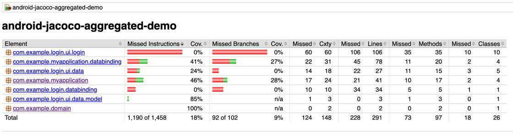
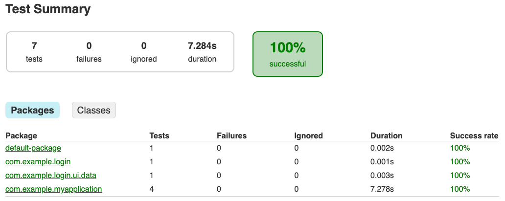

[](https://central.sonatype.com/artifact/io.github.gmazzo.test.aggregation.coverage/io.github.gmazzo.test.aggregation.coverage.gradle.plugin)
[](https://plugins.gradle.org/plugin/io.github.gmazzo.test.aggregation.coverage)
[](https://github.com/gmazzo/gradle-android-test-aggregation-plugin/actions/workflows/ci-cd.yaml)
[](https://codecov.io/gh/gmazzo/gradle-android-test-aggregation-plugin)
[](https://sourcegraph.com/search?q=content:io.github.gmazzo.test.aggregation+-repo:github.com/gmazzo/gradle-android-test-aggregation-plugin)

# gradle-android-test-aggregation-plugin

A couple of Gradle plugins to make Android modules work with
[JaCoCo Report Aggregation Plugin](https://docs.gradle.org/current/userguide/jacoco_report_aggregation_plugin.html)
and
[Test Report Aggregation Plugin](https://docs.gradle.org/current/userguide/test_report_aggregation_plugin.html)

# Usage

Apply the plugin at the **root** project:

```kotlin
plugins {
    id("io.github.gmazzo.test.aggregation.coverage") version "<latest>"
    // and/or
    id("io.github.gmazzo.test.aggregation.results") version "<latest>"
}
```

> [!NOTE]
> This plugin can not be applied along with the `java` one because it conflicts.
> If you have a Java root project, it's recommended to move it to a dedicated module

The `jacocoAggregatedReport` (for `coverage`) and `testAggregatedReport` (for `results`) will be
created
to aggregate test results from all projects in the build

The following is the old README.me of the demo project of
my [Medium article](https://medium.com/p/53e912b2e63c) about this topic,
now promoted to dedicated Gradle plugins:
[io.github.gmazzo.test.aggregation.coverage](https://plugins.gradle.org/plugin/io.github.gmazzo.test.aggregation.coverage)
and
[io.github.gmazzo.test.aggregation.results](https://plugins.gradle.org/plugin/io.github.gmazzo.test.aggregation.results)

## Filtering content

The plugins will automatically aggregate `android` modules and `java` modules that also apply
`jacoco` plugin on the
`jacocoAggregation` and the `testReportAggregation` configurations.

You control which projects are effectively included by using the DSL:

```kotlin
testAggregation {
    modules {
        include(project(":app"))
        exclude(projects.lib) // typesafe accessors are also supported!
    }
}
```

## Filtering coverage classes

You can use the DSL to include/exclude `.class` **files** from the aggregated JaCoCo coverage
report:

```kotlin
testAggregation {
    coverage {
        include("com/**/Login*") // will only include classes starting with `com.` containing `Login` on its name
    }
}
```

It's important to realize the filtering is done at `.class` file level (compiled classes).
You should not use classes names here but GLOB patterns.

# Demo project for aggregating Jacoco Android & JVM coverage reports

This is an example project that illustrates how can the
[JaCoCo Report Aggregation Plugin](https://docs.gradle.org/current/userguide/jacoco_report_aggregation_plugin.html)
and
[Test Report Aggregation Plugin](https://docs.gradle.org/current/userguide/test_report_aggregation_plugin.html)
can be used to aggregate a complex Android project with JVM modules in a single
`:jacocoAggregatedReport` and `:testAggregatedReport` tasks.

## Project structure

- A `plugin` included build that provides the `coverage` root plugin
- A `demo-project` with:
    - An `app` android module (with Robolectric tests)
    - A `login` android library module (with JUnit4/JVM tests)
    - A `domain` jvm module (with tests)

## The `test-aggregation` root plugin

The plugin fills the gaps between [AGP](https://developer.android.com/studio/releases/gradle-plugin)
and
[JaCoCo Report Aggregation Plugin](https://docs.gradle.org/current/userguide/jacoco_report_aggregation_plugin.html)
by providing the necessary setup missing:

- It applies `jacoco-report-aggregation` and `test-report-aggregation` at root project
- Creates `jacocoAggregatedReport` and `testAggregatedReport` for `TestSuiteType.UNIT_TEST`
- If a module applies `jacoco` plugin, it adds it to the `jacocoAggregation` and
  `testReportAggregation` root configurations
- If a module applies the `java` plugin, makes its child `jacocoAggregatedReport` task to depend on
  `test`
- If a module applies the `android` plugin:
    - it enables by default `BuildType.enableUnitTestCoverage` on `debug` to produce jacoco exec
      files
    - adds the `codeCoverageExecutionData`, `codeCoverageSources`, `codeCoverageElements` (classes)
      and `testResultsElements`
      outgoing variants, to allow `jacoco-report-aggregation` and `test-report-aggregation` to
      aggregate it

Please note that JVM still need to manually apply `jacoco` plugin (this is an intentional opt-in
behavior)
[build.gradle.kts](build.gradle.kts#L3)

## Producing an aggregated report for the whole project

The task `:jacocoAggregatedReport` is added to the root project when applying this plugin and it can
be
run to produce the report. All dependent `test` tasks will be run too to produce the required
execution data.


The same for `:testAggregatedReport`:


## Enforcing aggregated code coverage metrics

The same as `JaCoCo Plugin`
supports [Enforcing code coverage metrics](https://docs.gradle.org/current/userguide/jacoco_plugin.html#ex-configuring-violation-rules)
this plugin adds a ':jacocoAggregatedCoverageVerification' to provide the same feature, but with the
aggregated metrics:

```kotlin
tasks.jacocoAggregatedCoverageVerification {
    violationRules {
        rule {
            limit {
                minimum = "0.5".toBigDecimal()
            }
        }

        rule {
            isEnabled = false
            element = "CLASS"
            includes = listOf("org.gradle.*")

            limit {
                counter = "LINE"
                value = "TOTALCOUNT"
                maximum = "0.3".toBigDecimal()
            }
        }
    }
}
```

## The `aggregateTestCoverage` DSL extension

This is an opt-in/out switch meant to be used when having `productFlavors`.

`enableUnitTestCoverage` is a `BuildType` setting (default on `debug`). When having flavors, you'll
have many coverage reports to produce targeting `debug` (one per flavor variant).
You can use `enableUnitTestCoverage.set(false)` to turn aggregation off for an specific
`ProductFlavor`.
Basically, the variant won't be added to the `codeCoverageExecutionData` configuration, so
`:jacocoAggregatedReport` won't compute it

For instance, `app` module has a `environment` dimension with 2 flavors: `stage` and `prod`.
Without any extra settings, `:jacocoAggregatedReport` will depend on `:app:testStageDebugUnitTest`
and
`:app:testProdDebugUnitTest` (running its `src/test/` tests effectively twice).
You may choose which flavors participates in the aggregated report by doing:

```kotlin
    productFlavors {
    create("stage") {
        dimension = "environment"
    }
    create("prod") {
        dimension = "environment"
        aggregateTestCoverage.set(false)
    }
}
```

where it effectively only run `:app:testStageDebugUnitTest`

> [!NOTE]
> The `aggregateTestCoverage` DSL applies for both `:jacocoAggregatedReport` and
`:testAggregatedReport` tasks
